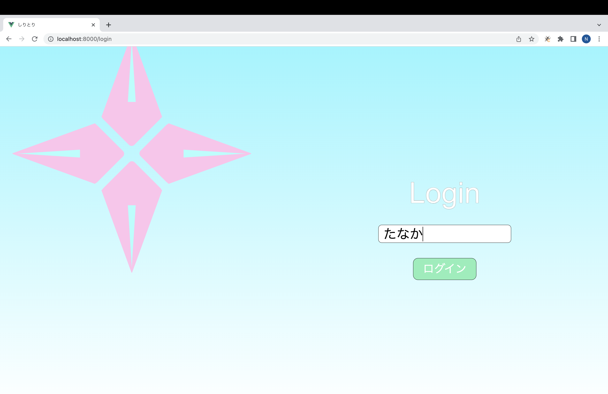
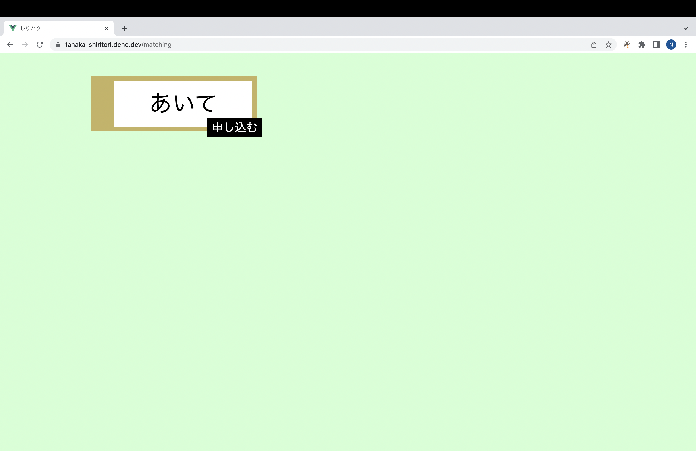
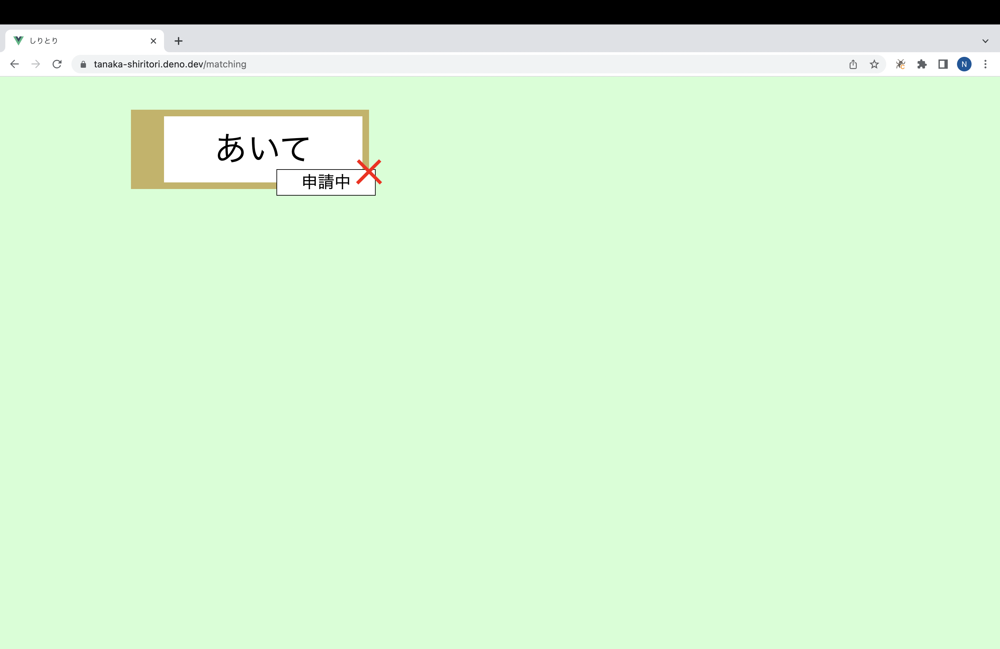
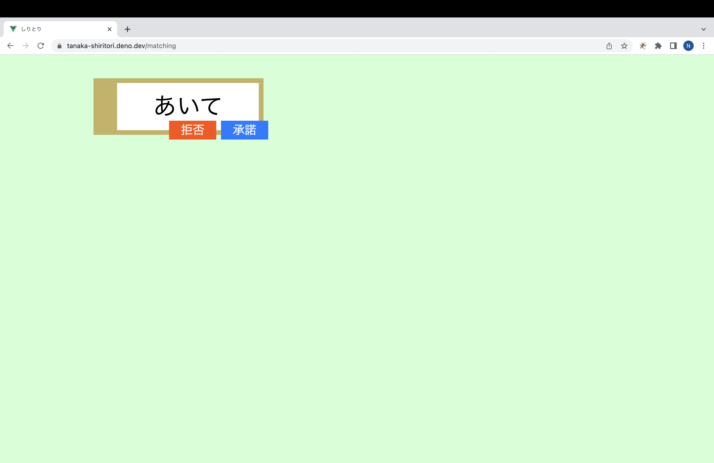
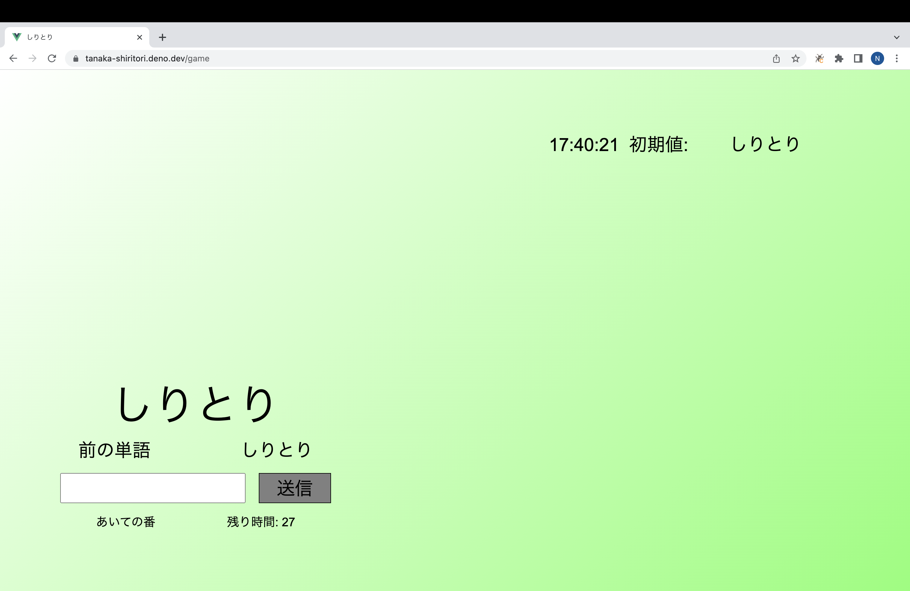
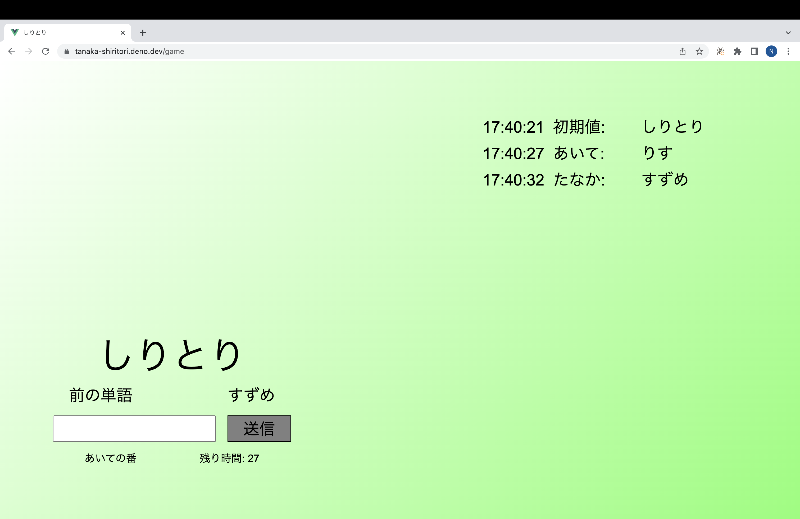

# しりとり

2022年夏のjig.jpインターンの選考課題です。

## 使い方

[Deno Deploy](https://tanaka-shiritori.deno.dev)を開きます。

ログイン画面が出てくるので、適当に名前を入れます。

このゲームは2人以上が同時にログインしてる状態じゃないとできません。

また、名前のみが識別子なので、同じ名前だと多分バグります。

ログインボタンを押すとホーム画面へ飛びます。

戦績ボタンは飾りです。

対戦ボタンを押してください。

他にプレイヤーがいれば、名前が出てきます。一人でする場合は別の端末か、違うブラウザでやってみてください。Sessionなので同じ端末同じブラウザでは相手になれません。

申し込みボタンで対戦を申し込めます。

申し込まれると受けるか受けないか選択できます。

受ける、または承諾されると、ゲームが始まります。

最初の文字は『しりとり』なので、自分のターンの時に打って送信ボタンかEnterしてください。

んがつく、重複する、30秒経過すると負けになって、alertが表示され、alertを閉じた4秒後にホームへ強制送還されます。

